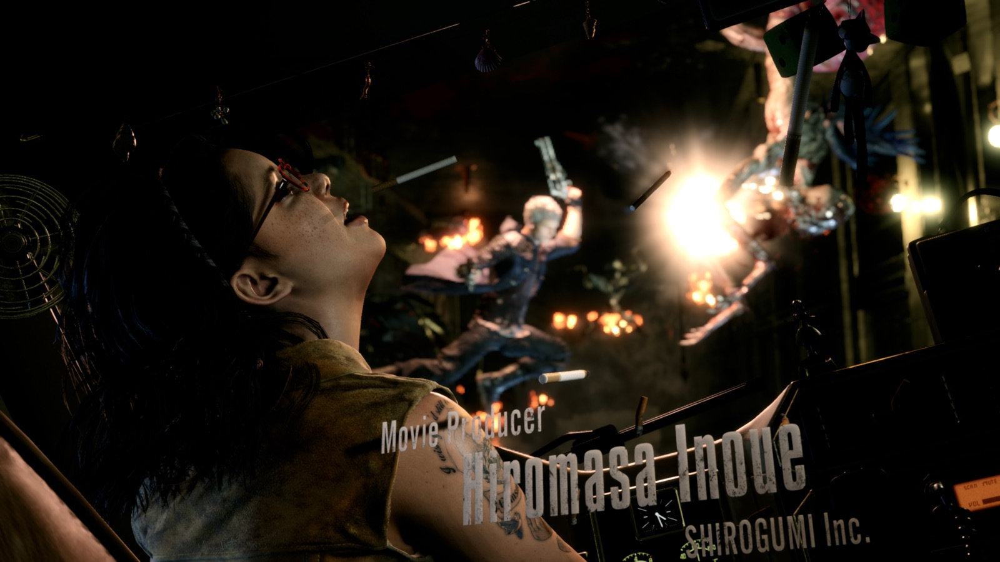
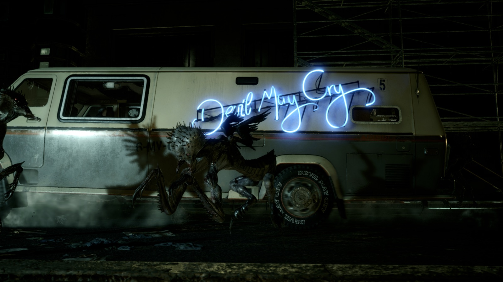
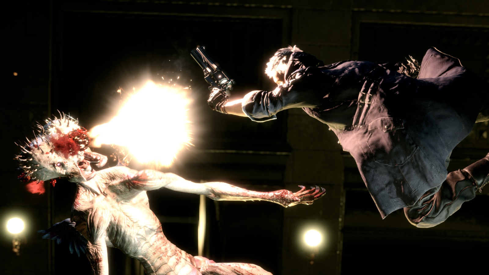

# Devil May Cry 5 — HDR on macOS

Enable Devil May Cry 5's native HDR presentation when playing through
CrossOver with D3DMetal or DXMT.

<p align="center">
  <a href="screenshots/dx11-hdr-multilight.heic">
    
  </a>
</p>

<p align="center">
  <a href="screenshots/dx11-hdr-neon.heic"></a>
  <a href="screenshots/dx11-hdr-gunshot.heic"></a>
</p>

> The images shown above are lightweight SDR previews. Select one to open the
> original 5120×2880 HDR HEIC capture. HDR playback depends on your browser,
> macOS version, and display.

## What the patch changes

The patch installs:

- a modified `DevilMayCry5.exe` that enables DMC5's HDR paths;
- `re_chunk_000.pak.patch_008.pak`, which contains two HDR shader replacements.

The original executable is saved as `DevilMayCry5.exe.pre-hdr`.

## Disclaimer

This patch modifies a copyrighted game executable for personal compatibility
purposes. It does not distribute the original game executable or proprietary
game assets. You must own a legitimate copy of Devil May Cry 5. This is an
independent community project and is not affiliated with or endorsed by
Capcom, CodeWeavers, Apple, or Valve. Use it at your own risk.

## Requirements

- CrossOver with D3DMetal or DXMT;
- an HDR-capable display;
- the supported DMC5 executable build.

Quit DMC5 before applying or restoring the patch. The patcher checks the game
build before it changes anything. It supports this executable SHA-256:

`1b881b52184fbb4de08740d68e77b49093bf4c5e8310ba185454fd34eba18e1d`

## Install

From this directory, run:

```bash
./patch-hdr.sh
```

Choose **Apply the HDR patch**, then drag the game's `DevilMayCry5.exe` into
Terminal. The patcher creates the backup and installs the shader archive next to
the executable.

For command-line use:

```bash
./patch-hdr.sh --yes "/path/to/Devil May Cry 5/DevilMayCry5.exe"
```

Check the installation without changing anything:

```bash
./patch-hdr.sh --check "/path/to/Devil May Cry 5/DevilMayCry5.exe"
```

## Restore

Use the guided patcher and choose **Restore**, or run:

```bash
./patch-hdr.sh --restore --yes "/path/to/Devil May Cry 5/DevilMayCry5.exe"
```

This restores the original executable and removes the shader archive installed
by this patch. The backup is kept.

## HDR settings

Select DirectX 11 or DirectX 12 in DMC5's graphics settings. Use DMC5's HDR
brightness and maximum-brightness controls to match the game to your display.

The patch has no runtime dependency on RenoDX, ReShade, or REFramework. The two
shader replacements are loaded by DMC5 from a normal RE Engine patch archive.

## Technical notes

DMC5 already contains native HDR support, but a GPU check blocks it when the
game runs through CrossOver. The executable patch bypasses that check for both
DirectX 11 and DirectX 12. For DX12, it also makes the game request the HDR10/PQ
output format used by D3DMetal.

The DX12 HDR service contains two hard-coded NVAPI function identifiers:
`0x84F2A8DF` for HDR capability and `0x351DA224` for display colour control.
These are NVAPI function IDs, not HDR modes. Under CrossOver, DMC5 does not
recognise the adapter as the vendor expected by that service, so the service
returns failure and the HDR transition stops. The patch bypasses those failed
gates; it does not emulate NVAPI or modify D3DMetal.

The patch then uses DMC5's existing DX12 swapchain call with color-space value
`12`. D3DMetal translates that request to the Apple PQ color space
(`kCGColorSpaceITUR_2100_PQ`) and enables the display's extended dynamic range.

The shader archive replaces DMC5's HDR post-process and final Rec.2020/PQ
conversion shaders. These replacements are adapted from the DMC5 module in
RenoDX, run as part of DMC5's normal render pipeline, and use DMC5's existing
brightness controls. No shader injector is needed at runtime.

## Credits

Shader work is adapted from [RenoDX](https://github.com/clshortfuse/renodx)
under the MIT License. See [THIRD_PARTY_NOTICES.md](THIRD_PARTY_NOTICES.md).
